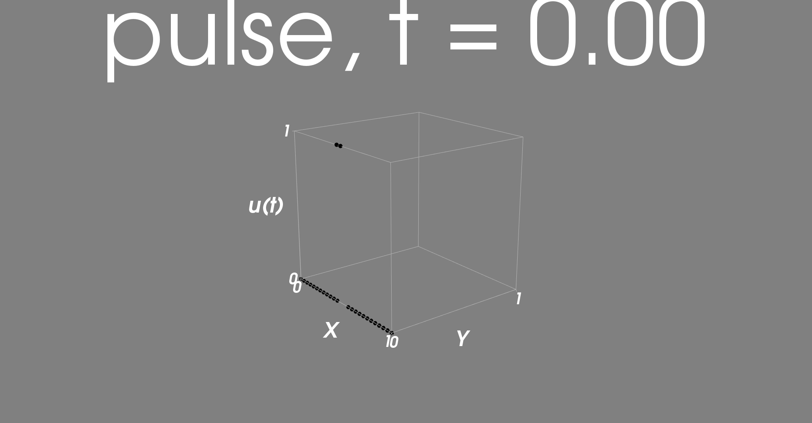
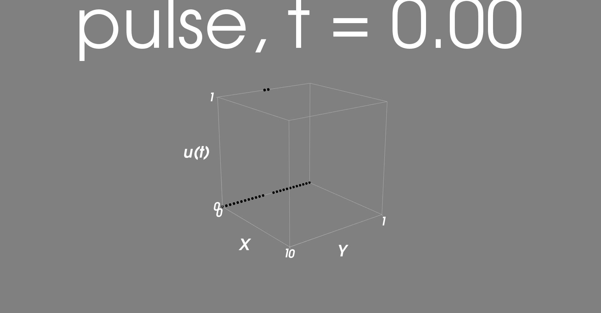
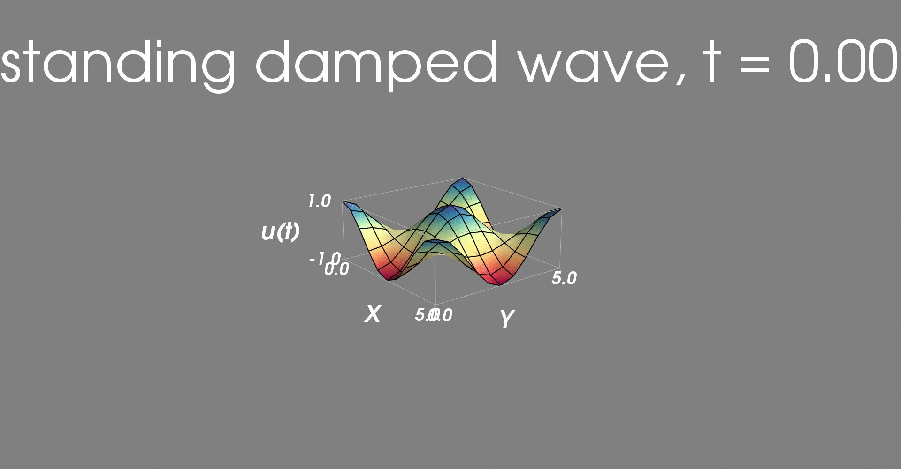

# Project 1: two-dimensional, standard, linear wave equation, with damping

### Overview
The tasks are described in [wave_project_tasks.pdf](doc/wave_project_tasks.pdf). The answers were given in a report, see [report_wave_project.pdf](doc/report_wave_project.pdf). The implementation of the numerical solution can be found in [wave2D.py](src/wave2D.py). There is a function for every task that computes and animates the result. If you want to know how the animation works, see [test_animation.py](src/test_animation.py).

The following sections demonstrate some examples.

### Task 3.3: Exact 1D plug-wave solution in 2D
There is a pulse function that is split into two identical 1D waves. They are moving in opposite direction, exactly one cell per time step. The discrete solution is then equal to the exact solution.

Pulse in x-direction       |  Pulse in y-direction
:-------------------------:|:-------------------------:
      |  

### Task 3.4: Standing, undamped waves
Exact solution as a colored surface, numerical solution visualized as a grid.

### Task 3.6:  Standing, damped waves (manufactured solution)
Exact solution as a colored surface, numerical solution visualized as a grid.

### Task 4: Tsunami over a subsea mountain

